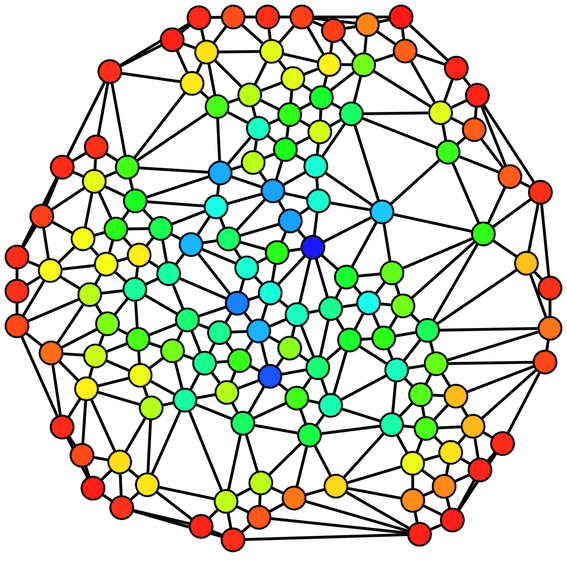

# centrality-nubank
A simple RESTful server application to solve the graph centrality problem



## Problem description

In this challenge, suppose we are looking to do social network analysis for prospective customers. We want to extract from their social network a metric called "closeness centrality".

Centrality metrics try to approximate a measure of influence of an individual within a social network. The distance between any two vertices is their shortest path. The *farness* of a given vertex *v* is the sum of all distances from each vertex to *v*. Finally, the *closeness* of a vertex *v* is the inverse of the *farness*.

The first part of the challenge is to rank the vertices in a given undirected graph by their *closeness*. The graph is provided in the attached file; each line of the file consists of two vertex names separated by a single space, representing an edge between those two
nodes.

The second part of the challenge is to create a RESTful web server with endpoints to register edges and to render a ranking of vertexes sorted by centrality. We can think of the centrality value for a node as an initial "score" for that customer.

The third and final part is to add another endpoint to flag a customer node as "fraudulent". It should take a vertex id, and update the internal customer score as such:
- The fraudulent customer score should be zero.
- Customers directly related to the "fraudulent" customer should have their score halved.
- More generally, scores of customers indirectly referred by the "fraudulent" customer should be multiplied by a coefficient F:

F(k) = (1 - (1/2)^k)

where k is the length of the shortest path from the "fraudulent" customer to the customer in question.

## Rules and assumptions

- Edge weight == 1
- edges.txt must be read and loaded when the application starts
- REST server might receive new vertexes, not necessarily existed previously
- The graph is not necessarily connected

## Solution

- Read edges.txt, create an adjacency map (given a vertex returns adjacent vertex)
- Implement [Breadth First Search](https://en.wikipedia.org/wiki/Breadth-first_search) to find the shortest paths of a vertex to every other in the graph
- Use BFS for all vertexes, put the result in a map, calculate and sort closeness
- When a fraud is signalized, recalculate and sort the closeness of every connected node
- When an edge is added, recalculate and sort the closeness of the whole graph

## Dependencies

- [JDK](http://www.oracle.com/technetwork/java/javase/downloads/jdk7-downloads-1880260.html) 7
- [Scala](http://www.scala-lang.org/) 2.10.5
- [SBT](http://www.scala-sbt.org/) 0.13.0
- [Spray.io](http://spray.io/) 1.3.2
- [Akka](http://akka.io/) 2.3.6

## Building, testing and running 

The application uses Scala's [SBT](http://www.scala-sbt.org/) tool. To build it, cd to the project root dir and type

```shell
sbt compile
```

To run tests:

```shell
sbt test
```

To run the application and star the REST server:

```shell
sbt run
```

The shell output should be something like the following:


### Initial thoughts / brainstorm

- Implement [Floyd-Warshall algorithm](https://en.wikipedia.org/wiki/Floyd%E2%80%93Warshall_algorithm). Maybe could be simplified since edge weight == 1
- Use [breadth first search](https://en.wikipedia.org/wiki/Breadth-first_search), probably better than Floyd-Warshall
- Each time a vertex is added, the closeness of each vertex must be recalculated. Can we optmize it?? 
- When a fraud is detected, must recalculate closeness of each vertex. Can we optimize it??

Other ideas:
- Use lazy evaluation??
- Djikstra Algorithm
